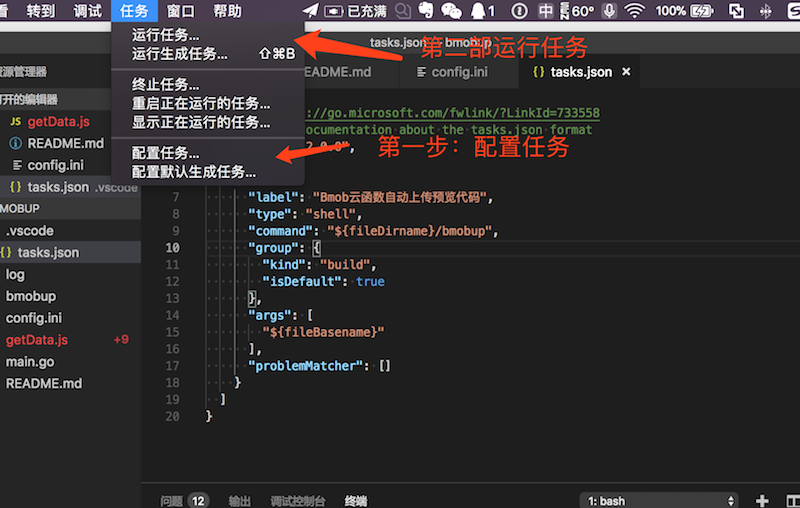

# Bmob云函数上传预览开发插件


Bmob平台Node、Java云函数本地开发调试工具,增加云函数开发效率，支持`Mac`,`Windows`,`liunx`系统 。它的流程会把你本地写的代码，提交到Bmob应用云函数并返回结果。


Java云函数有个本地函数批量上传调试环境，需要的请看 https://github.com/bmob/BmobJavaCloud

[Java 云函数文档]: https://github.com/bmob/BmobJavaCloud


## 一、Installation

1.下载本项目内以下文件到本地

```
bmobup  //命令行工具
config.ini	//配置文件，填写Bmob，id，key等信息
getData.js  //Demo 获取用户表云函数
```


2.把上面文件放到同一个文件夹，如果写自己的云函数，可以新建个 `xxx.js` 里面实现自己的代码，Java，可以新建个 `xxx.java` 

## 二、运行

1.第一步：配置config.ini信息


2.第二步：

unix

```
 方式1：当前目录下执行
 	$./bmobup xxx.js
 方式2：命令行设置为全局命令
 	把bmobup命令行文件放到/usr/sbin/下
 	然后运行 $ bmobup xxx.js
 方式3:推荐方式，配置 vscode 任务调试
 请看下面截图教程
 
 
```

windows

```
$ bmobup.exe xxx.js
```

3.截图教程




```
{
  // See https://go.microsoft.com/fwlink/?LinkId=733558
  // for the documentation about the tasks.json format
  "version": "2.0.0",
  "tasks": [
    {
      "label": "Bmob云函数自动上传预览代码",
      "type": "shell",
      "command": "${fileDirname}/bmobup", //关键这一步，命令行路径，如果放在当前项目下，则这样配置
      "group": {
        "kind": "build",
        "isDefault": true
      },
      "args": [
        "${fileBasename}"
      ],
      "problemMatcher": []
    }
  ]
}
```


点击运行任务，即可自动上传，并返回结果。


## 三、目录文件说明

```
.gitignore		//git 忽略文件
.vscode/		//vscode软件配置文件
README.md		//说明文件
bmobup			//执行命令
config.ini		//配置文件
getData.js		//demo文件
img/			//图片
log/			//错误日志
```

